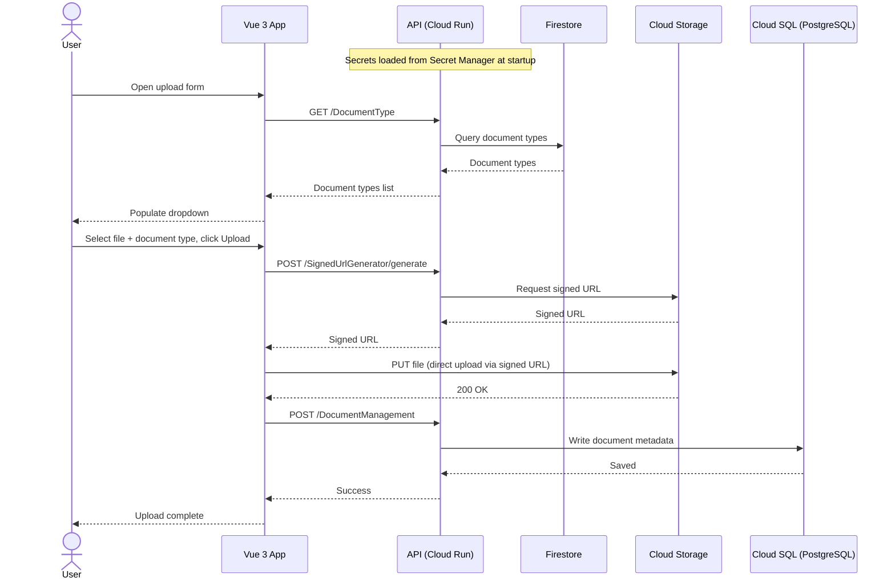

# Architecture – Storage Management App

## Overview

A document management system deployed on **Google Cloud Platform**. Users upload documents through a Vue 3 web interface; the system stores files in Cloud Storage via a signed URL, metadata in Cloud SQL (PostgreSQL), and document types in Firestore.

---

## System Architecture



---

## Components

### Frontend — `storage-management/app/webapp`

| Property | Value |
|---|---|
| Framework | Vue 3 |
| UI Library | PrimeVue |
| Type | Single Page Application (SPA) |
| Responsibilities | Document upload UI, document listing, document type selection |

### Backend API — `storage-management/app/api`

| Property | Value |
|---|---|
| Framework | ASP.NET Core 10 |
| Runtime | Cloud Run |
| Responsibilities | Generate signed URLs for Cloud Storage, write document metadata, serve REST endpoints |

### Data Access Layer — `storage-management/app/dal`

| Property | Value |
|---|---|
| Technology | Entity Framework Core |
| Target | Cloud SQL (PostgreSQL) |
| Responsibilities | Database access for document metadata |

### Shared Entities — `storage-management/app/sharedentities`

Shared domain models and entity definitions referenced by both the API and DAL. Not independently deployable — consumed as a project reference.

---

## Data Flow

### Document Upload

```
1. User opens the upload form
   → GET /DocumentType → API → Firestore
   → document type list populated in dropdown

2. User selects a file + document type, clicks Upload
   → POST /SignedUrlGenerator/generate → API → Cloud Storage
   → signed URL returned to frontend

3. Frontend uploads the file directly to Cloud Storage using the signed URL
   (file binary never passes through the API)

4. Frontend notifies the API to record the upload
   → POST /DocumentManagement → API → Cloud SQL
   → document metadata saved (filename, storage path, document type, etc.)
```

### Document Listing

```
1. Frontend sends a GET request to the API
2. API queries Cloud SQL via DAL for document metadata
3. API returns the document list to the frontend
```

---

## Google Cloud Services

| Service | Purpose |
|---|---|
| **Cloud Run** | Hosts the ASP.NET Core 10 API — serverless, auto-scaling |
| **Cloud Storage** | Stores uploaded document files (binary blobs) |
| **Cloud SQL (PostgreSQL)** | Stores document metadata (structured relational data) |
| **Firestore** | Stores document type definitions (flexible, schema-less) |
| **Secret Manager** | Stores sensitive credentials (DB connection strings, API keys) at runtime |

---

## Infrastructure

Provisioned and managed via **Terraform**.

```
/
├── docs/
├── storage-management/
│   ├── app/
│   │   ├── api/               # ASP.NET Core 10 API
│   │   ├── webapp/            # Vue 3 frontend
│   │   ├── dal/               # Data access layer (EF Core + PostgreSQL)
│   │   └── sharedentities/    # Shared domain models
```

---

## Security

- **Secret Manager** is used to inject secrets (e.g. database connection strings, service account credentials) into the API at runtime — no secrets are stored in source code or environment variable files.
- Cloud Run services use **IAM service accounts** with least-privilege access to GCP resources.
- Inter-service communication within GCP stays on Google's private network where possible.

---

## Further Reading

- [Build Instructions](build.md) – Local development setup, dependencies, emulators
- [Deployment Guidelines](deployment.md) – Deployment to GCP
